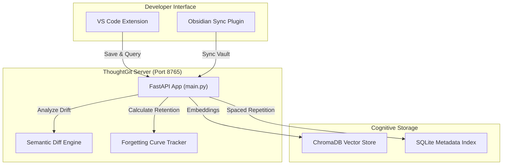

# 🧠 ThoughtGit
> **Version Control for Human Thinking.** Track, visualize, and optimize developer learning, cognitive evolution, and memory stability in real time.

---

## 📖 Introduction & Problem Statement
Developers read thousands of lines of documentation, draft architecture plans, and learn complex new patterns daily. While standard Git tracks the *lines of code* that change, the **developer's mental state, design intent, and conceptual learning paths are completely lost**.

**ThoughtGit** solves this by providing a unified, branch-aware cognitive version control system. It indexes developer thoughts, detects concept drift over time, schedules spaced repetition reviews based on cognitive forgetting curves, and maps your repository structure visually.



---

## ⚡ Key Features

### 1. 🌐 Interactive Project Visualizer (VS Code)
A full-width, dynamic visual dashboard split into two modules:
*   **Semantic Concept Map (D3.js)**: A force-directed layout displaying your saved learning topics.
    *   *Drag-to-Pin*: Drag nodes to custom positions where they remain pinned permanently.
    *   *Double-Click-to-Release*: Double-click any node to return it to the free-floating layout.
    *   *Date Timeline Slider*: Filter and playback concept mapping chronologically.
*   **Codebase Dependency Flow (Mermaid.js)**: A high-level flowchart mapping folder dependencies (e.g. `api/` ➔ `core/`).
    *   *Folder Popovers*: Click any folder node to open a popover list of its files. Click any file to open it instantly.

### 2. ⏳ Branch-Aware Semantic Timelines
*   Thoughts are linked directly to your active Git branch (e.g. `main`, `feature/auth`).
*   The **Evolution View** displays chronological shifts in your understanding of specific concepts, complete with similarity matching and automatic drift classification.

### 3. 🧠 Memory Stability & Health Engine
*   **Forgetting Curve Tracker**: Evaluates retention strength ($R = e^{-t/S}$) for saved topics based on access logs.
*   **Review Scheduler**: Suggests topics for review when retention drops below 40%.
*   **Memory Health Report**: Computes spacing frequency, topic diversity, and active logging metrics into a unified cognitive health score.

---

## 🛠️ Repository Architecture
The repository is designed to be fully self-contained and modular:
```text
thoughtgit/
├── vscode-extension/      # The entire self-contained VS Code Extension client & Python backend
│   ├── api/               # FastAPI backend server (endpoints, routing)
│   ├── core/              # Core logic, ChromaDB, cognitive spacing algorithms
│   ├── scratch/           # Background process managers
│   ├── ui/                # Streamlit analytics dashboard
│   ├── src/               # VS Code TypeScript client code
│   └── tests/             # Python unittest suite
├── obsidian-plugin/       # Obsidian sync vault plugin
└── mcp_server/            # Model Context Protocol integration server
```

---

## 🚀 Installation & Usage

### Step 1: Pull the Embedding Model
ThoughtGit runs a local semantic vector search engine. Make sure you have [Ollama](https://ollama.com/) running locally and pull the text embedding model:
```bash
ollama pull nomic-embed-text
```

### Step 2: Install from VS Code Marketplace
1. Open **VS Code**.
2. Press **`Ctrl+Shift+X`** (or `Cmd+Shift+X` on macOS) to open the Extensions tab.
3. Search for **`ThoughtGit`** and click **Install**.
4. Click the **Brain Icon** 🧠 in your VS Code Activity Bar on the left.
5. Open any project workspace. The extension will **automatically set up the Python environment and run the backend silently in the background** on launch!
6. Click **Open Project Visualizer** to launch the dynamic, real-time updated concept map and folder structure flow!

---

## 🧪 Running Local Tests
If you are developing locally, run our test suite using:
```bash
python -m unittest discover -s tests
```

## 🤝 Contributing
We love contributions! Whether you want to improve the spaced-repetition spacing algorithms, polish the interactive D3/Mermaid visualizer panels, or build new client plugins (e.g. for Logseq or Neovim), feel free to open a Pull Request.

1. Fork the repo and create your branch (`git checkout -b feature/amazing-feature`).
2. Commit your changes with semantic messages.
3. Ensure all python tests pass: `python -m unittest discover -s tests`.
4. Open a Pull Request!

---

### Built with ❤️ by Shrinidhi


